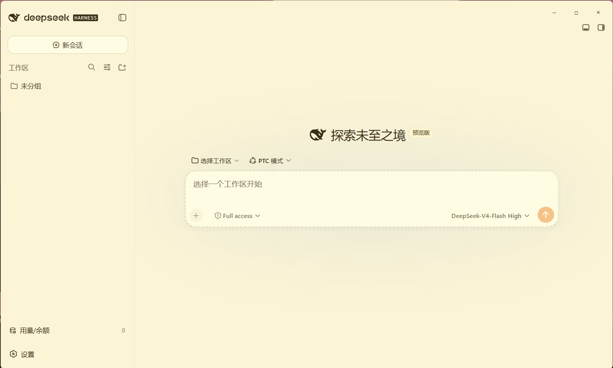

# dsh-starter

DeepSeek Harness 的桌面客户端。一个 Electron 壳，把官方 Web 界面装进原生窗口，不重写 DSH 本身。

[中文](#中文) · [English](#english)

[](LICENSE)

---

<a id="中文"></a>

## 中文

**目录**：[这是什么](#这是什么) · [为什么选它](#为什么选它) · [快速开始](#快速开始) · [功能一览](#功能一览) · [数据目录](#数据目录) · [更新日志](#更新日志) · [开发](#开发) · [打包](#打包) · [隐私](#隐私) · [许可证](#许可证)

### 这是什么

把官方 [deepseek-ai/DeepSeek-Harness](https://github.com/deepseek-ai/DeepSeek-Harness)（`@deepseek-ai/dsh`，一切皆插件的 agent harness）封装成 Windows 桌面客户端。壳自己拉起本机的 `dsh` 服务，把官方 Web GUI 渲染进无边框窗口，只负责窗口、托盘、通知、服务生命周期四件事，界面和 agent 能力都在 DSH 侧。

<p></p>

### 为什么选它

| 维度 | 官方 DeepSeek Harness | dsh-starter |
| --- | --- | --- |
| 安装与启动 | 需自行准备 Node.js，通过 CLI 启动 | 内置 DSH + Node 运行时，离线安装包双击即用 |
| 插件 | 手动安装、手动排障 | 106 个预装插件随包，首启自动就位；崩溃自动诊断、自动停用（移走可恢复） |
| 桌面体验 | 主要在终端或浏览器中使用 | 原生窗口、系统托盘、任务通知、崩溃自动恢复（指数退避） |
| 配置 | 手动改配置文件 | 皮肤/主题/权限/模型引用随包，首启自动补；API key 自行配置 |
| 维护 | 出问题靠手动排查 | 自愈机制：patch 双挂、坏 YAML、安装回退被挡、渲染崩溃全自动处理，诊断报告一键复制 |

> 不修改官方 dsh 内核，完整保留插件架构与官方能力；API Key 由你在 DSH 设置里自行配置，壳不落明文。

### 快速开始

1. 双击安装包（向导式，可选安装目录），秒级装完。
2. 首启自动播种 106 插件 + 配置，DSH 冷启动约 40 秒，走一遍简短向导（模型 + API key）。
3. 之后双击图标即进入窗口。

| 文件 | 说明 | 大小 |
| --- | --- | --- |
| [deepseek-harness-starter-Setup-0.4.3.exe](https://github.com/sryimnoob123/dsh-starter/releases) | 安装版（内置 DSH + 106 插件，离线） | ~148 MB |

### 功能一览

- 无边框窗口 + 自绘标题栏（最小化/最大化/关闭缩托盘），Codex 风格浅色/深色/跟随系统
- 离线安装包：DSH 运行时 + 106 插件全内置，装的时候不跑 npm、不联网
- 插件自救：崩溃自动诊断 → 自动停用问题插件（移走不是删除，一键恢复）→ 重启
- 自动修复：patch 双挂、坏 YAML（自动回退备份）、安装回退目录被真实目录挡住
- 渲染崩溃自愈：黑屏自动重载（2 分钟内 ≤3 次），杀软打断走友好提示
- 热挂载失败检测：服务活着但单插件挂不上 → 自动停用 + 重启服务 + 系统通知
- 诊断报告：每次事件生成三段式报告（问题/状态/处置，已脱敏），复制剪贴板 + 落盘
- 自动更新（点击才下载、确认才安装，GitHub Releases）
- 系统托盘（打开/停止服务/日志/设置/检查更新/帮助/退出）+ 一键「压缩上下文」
- 任务完成/失败通知 + 通知历史 + 卡住看门狗（5 分钟无活动提醒）
- 文件路径菜单 + 拖文件进对话成 `@路径` 引用
- 首启向导（模型 + API 连接）
- Node.js 自动补齐（无系统 Node 时自动下载）
- Windows 持久终端修复（内置 win-terminal-inspector，首启自动装）
- 仅监听本机（`127.0.0.1`）

### 数据目录

| 位置 | 内容 |
| --- | --- |
| `<安装目录>/dsh-home/` | DSH 数据：会话、API Key（凭据存储）、插件配置、皮肤 |
| `<安装目录>/dsh/` | DSH 运行时（node_modules） |
| `%APPDATA%/deepseek-harness-starter/` | 壳配置、日志、诊断报告、插件隔离备份 |

三样同目录（exe + dsh + dsh-home），卸载即清。

### 更新日志

#### v0.4.3（2026-08-24）

**插件自救**

- 新增崩溃自愈引擎：启动/运行崩溃自动诊断 → 自动停用问题插件（移走不删除，可一键恢复）→ 递归重启。
- 新增自动修复通道：patch 双挂（重复挂载条目）、坏 YAML（自动回退写前备份 + 净化）、安装回退目录被真实目录挡住（移走挡路目录）。
- 新增渲染进程崩溃自愈：黑屏自动重载（2 分钟内 ≤3 次），安全软件/调试器打断特征走友好提示不刷屏。
- 新增热挂载失败检测：服务存活但单插件挂不上 → 自动停用 → 重启服务 → 系统通知。
- 新增诊断报告：每次事件生成三段式报告（问题/状态/处置，已脱敏），复制剪贴板 + 落盘环形保留。

**UI 判定区域修复**

- 修复界面判定区域（可点击/可拖拽热区）的误判问题，窗口交互更跟手。

**更新机制改造**

- 更新改为「点击才下载、确认才安装」，不再自动下载占用带宽。
- 新增更新进度窗（发现/下载中/已下载/错误全状态可见），右上角按钮四态（无/可下载/下载中/待安装）结构化同步。
- 修复下载完成通知重复弹出、手动检查无即时反馈、进度窗卡在检查中等问题。

**内置插件加入**

- 新增壳内置插件：插件市场（dshmarket）、启动守卫（dsh-boot-guard）、撤销保存点（dsh-undo-savepoint）、诊断工具（@moonquake2004/dsh-doctor），随壳打包、零 npm 依赖。
- 预装随包插件：用量统计（dsh-usage-stats）、增强侧栏（dsh-better-sidebar）、上下文管理（dsh-context）、插件查找（dsh-find-plugin）、模型透镜（@liustack/modlens）、市场插件（@sanqi-normal/dsh-webui-market-plugin）。

**DSH 内核更新**

- 内置 DeepSeek Harness 内核升级至 0.1.1-rc.2，随包离线分发。

**全局提示词功能插件化**

- 全局/项目级 AGENTS.md、persona/身份注入、运行时上下文开关整体迁入独立插件 `@dsh-desktop/plugin-global-prompt`，随壳内置，与独立发布版互不干扰。

### 开发

```bash
pnpm install
pnpm test          # 跑测试（488 个）
pnpm typecheck
pnpm build         # 编译 TypeScript + 拷贝资源
pnpm start         # 开发运行
pnpm prepare:dsh   # 预下载 DSH 到 vendor/dsh（安装包用）
pnpm dist          # 打 Windows 安装包（内置 DSH + 种子，离线）
```

### 打包

- `scripts/prepare-seed.mjs` 构建种子（`build/dsh-home-seed/`）：106 插件 web profile + 非敏感设置，净化剔除隐私（凭据/会话/日志）。
- `build/electron-builder.yml`：NSIS 7z 压缩载荷 + `extraFiles` 带 DSH 与种子；`asarUnpack` 解包内置插件（asar 只读 FS 复制会 ENOENT）；`oneClick: false` 可选安装目录。
- 首启播种两阶段：spawn 前种 profile，service-ready 后补设置（防 DSH 覆盖）→ 清理种子残留。终态目录 = exe + `dsh/` + `dsh-home/` 三件套，与历史版本一致。
- **隐私门禁**：打包后扫描安装包，出现凭据/会话/key 特征即拒发（发布红线）。

### 隐私

- 仅监听本机 `127.0.0.1`，不对外提供服务。
- API 密钥存在 DSH 自己的凭据存储（`DSH_HOME`）里，壳不落明文、不收集、不上传。
- 安装包发布前经隐私反证扫描，保证不含任何私人文件。

### 许可证

[MIT](LICENSE)。独立社区项目，与 DeepSeek 无隶属关系。应用图标为 DeepSeek 官方鲸鱼，仅用于标识上游项目，版权归 DeepSeek。

### 致谢

- [dsh-win-terminal-inspector](https://github.com/clearkurt/dsh-win-terminal-inspector)（MIT，© 2026 clearkurt），内置以修复 DSH 缺失的 Windows 终端检查器，原样使用、未做修改。源码、许可与溯源均保留在 `vendor/win-terminal-inspector/`。

---

<a id="english"></a>

## English

**Contents**: [What is this](#what-is-this) · [Why](#why) · [Quick start](#quick-start) · [Features](#features) · [Data layout](#data-layout) · [Changelog](#changelog) · [Development](#development) · [Packaging](#packaging) · [Privacy](#privacy) · [License](#license)

### What is this

A thin [Electron](https://www.electronjs.org/) shell for [DeepSeek Harness](https://github.com/deepseek-ai/DeepSeek-Harness). It starts its own local `dsh` service and renders the official web GUI inside a frameless window. The shell owns four things only: window, tray, notifications, service lifecycle. Everything else lives on the DSH side.

<p></p>

### Why

|  | Official DSH | dsh-starter |
| --- | --- | --- |
| Install | Manual Node + CLI | Offline installer, DSH bundled, seconds with progress bar |
| Plugins | Manual install & debug | 106 plugins ship with the package, self-healing on crash |
| Desktop | Terminal/browser | Native window, tray, notifications, auto-recovery |
| Config | Manual | Non-sensitive settings seeded on first launch |
| Upgrades | Manual | Self-healing for broken configs, one-click diagnostic report |

### Quick start

1. Run the installer (wizard, pick your directory) — finishes in seconds.
2. First launch seeds 106 plugins + settings, boots DSH (~40s), then a short wizard for your model & API key.
3. Done — double-click the icon to enter.

### Features

- Offline installer: DSH runtime + 106 plugins bundled, no npm at setup
- Self-healing: crash diagnosis → auto-isolate broken plugin (moved, one-click restore) → restart
- Auto-repair: duplicate plugin entries, bad YAML (backup restore), blocked fallback dirs
- Renderer-crash auto-reload (≤3 per 2 min), antivirus-breakpoint hint
- Hot-mount failure detection → auto-isolate + restart
- Diagnostic report per incident (redacted, clipboard + disk)
- Auto updates (download on click, install on confirm)
- Tray menu, one-click "Compact context", notifications, 5-min stall watchdog
- File-path menu + drag-to-`@path`, first-run wizard, Node auto-provisioning
- Windows persistent-terminal fix (bundled win-terminal-inspector)
- Localhost only (`127.0.0.1`)

### Data layout

| Location | Contents |
| --- | --- |
| `<install>/dsh-home/` | DSH data: sessions, credentials, plugin configs, theme |
| `<install>/dsh/` | DSH runtime |
| `%APPDATA%/deepseek-harness-starter/` | Shell config, logs, diagnostic reports, rescue backups |

### Changelog

#### v0.4.3 (2026-08-24)

**Self-healing**

- Crash diagnosis engine: auto-diagnose boot/runtime crashes → auto-disable the problem plugin (moved, not deleted, one-click restore) → recursive restart.
- Auto-repair channels: duplicate plugin entries, bad YAML (backup restore + sanitize), blocked install-fallback dirs (moved aside).
- Renderer-crash self-heal: auto-reload (≤3 per 2 min); security-software/debugger breakpoints get a friendly hint instead of reload loops.
- Hot-mount failure detection: service alive but a plugin fails to mount → auto-disable → restart service → notify.
- Diagnostic report per incident (problem/state/action, redacted) — clipboard + ring-buffered disk.

**UI hit-area fixes**

- Fixed clickable/draggable hot-area misjudgments; window interaction feels more responsive.

**Update mechanism rework**

- Updates changed to "download on click, install on confirm" — no silent bandwidth use.
- Update progress window (discovered/downloading/downloaded/error) + top-right button four-state sync.
- Fixed repeated download-finished notifications, no feedback on manual check, and the progress window stuck on "checking".

**Bundled plugins added**

- New shell-bundled plugins: plugin market (`dshmarket`), boot guard, undo-savepoint, doctor — zero npm deps.
- Pre-installed seed plugins: usage stats, better sidebar, context manager, plugin finder, modlens, webui market plugin.

**DSH core update**

- Bundled DeepSeek Harness core updated to 0.1.1-rc.2 (ships offline in the installer).

**Global prompt as plugin**

- Global/project AGENTS.md, persona/identity injection, runtime-context toggle moved into the standalone plugin `@dsh-desktop/plugin-global-prompt`, bundled with the shell.

### Development

```bash
pnpm install
pnpm test          # 488 tests
pnpm typecheck
pnpm build
pnpm start
pnpm prepare:dsh
pnpm dist          # Windows installer (bundled DSH + seed)
```

### Packaging

- `scripts/prepare-seed.mjs` builds the seed (`build/dsh-home-seed/`): 106-plugin web profile + non-sensitive settings, privacy-scrubbed.
- `build/electron-builder.yml`: NSIS 7z payload + `extraFiles` for DSH runtime & seed; `asarUnpack` for bundled plugins; `oneClick: false` for install-dir choice.
- Two-phase first-run seeding (profile → settings after service-ready) so settings survive; final layout = `exe + dsh/ + dsh-home/`, same as previous versions.
- Privacy gate: the installer is scanned before release — any credential/session/key marker blocks the build.

### Privacy

- Bound to `127.0.0.1` only; never serves outside the machine.
- Your API key lives in DSH's own credentials store; the shell never writes, collects, or uploads it.
- The release installer is privacy-scanned automatically.

### License

[MIT](LICENSE). Independent community project, not affiliated with DeepSeek. The whale icon is a DeepSeek asset used only to identify the upstream project.

### Acknowledgments

- [dsh-win-terminal-inspector](https://github.com/clearkurt/dsh-win-terminal-inspector) (MIT, © 2026 clearkurt) — bundled unmodified to fix DSH's missing Windows terminal inspector. Source, license, and provenance are kept in `vendor/win-terminal-inspector/`.
