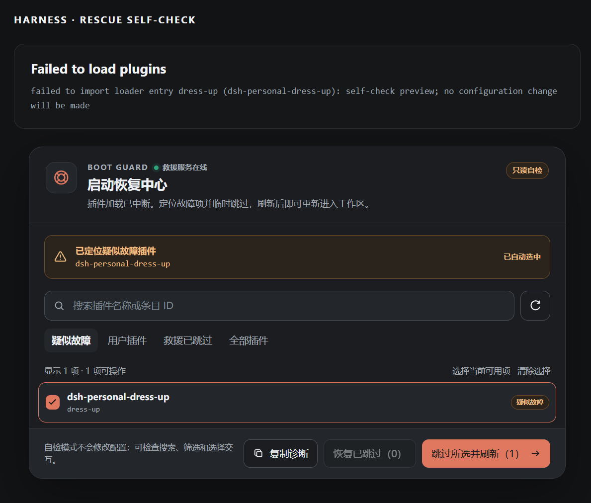

# dsh-boot-guard

简体中文 · [English](README.en.md)

[](https://github.com/SaiSenBox/dsh-boot-guard/actions/workflows/check.yml)
[](LICENSE)

> 插件把插件管理页面一起弄崩了，接下来怎么办？

`dsh-boot-guard` 是给 [DeepSeek Harness](https://github.com/deepseek-ai/deepseek-harness) Web UI 准备的一道小保险。正常情况下它安安静静地待着；只有插件加载失败、页面只剩下 `Failed to load plugins` 时，它才会出现，帮你找出可疑插件、临时跳过，然后把工作区救回来。



_上图是只读自检模式，只展示界面和诊断结果，不会真的改配置。_

## 为什么写它

起因其实有点尴尬：我在给 DSH 调一个界面插件，刷新之后，整个 Web UI 直接起不来了。

问题插件本来应该去插件管理页里关掉，可插件管理页也属于 Web UI。结果就像把车钥匙锁在车里——明明知道是哪儿出了问题，却没有入口修它。

Boot Guard 就是为这个死循环写的。它不依赖正常的客户端插件加载链，而是由 host 直接把一段很小的救援脚本放进失败页面。其他插件没能加载时，它仍然有机会工作。

## 它能做什么

- 从加载错误里找出疑似故障插件，并自动选中
- 默认只看用户插件，也可以搜索名称或 loader 条目 ID
- 临时跳过一个或一批插件，刷新后立即重新尝试启动
- 单独恢复某个插件，或二次确认后恢复全部救援跳过项
- 明确区分“Boot Guard 临时跳过”和“配置原本就禁用”
- 复制一份简短诊断，方便贴到 Issue 里一起排查
- 界面提供中文和英文，并跟随 DSH 设置里的语言选项
- 提供暗色、亮色和窄屏适配的只读自检页

它不会删除插件，也不会碰插件的数据。所谓“跳过”，只是向当前 DSH profile 的 `cordis.patch.yml` 写入一个带 Boot Guard 标记的 `disabled: true` 数组项；写入前会识别空文件、`[]` 和已有数组，恢复时也只会删除自己写入的块。

## 安装

需要先安装并运行 [DeepSeek Harness](https://github.com/deepseek-ai/deepseek-harness)。

### 从 GitHub 安装

```sh
dsh plugin --profile web add github:SaiSenBox/dsh-boot-guard
```

安装完成后重启 `dsh web`。

### 从 npm 安装

如果这个包已经发布到 npm，可以直接用：

```sh
dsh plugin --profile web add dsh-boot-guard
```

### 本地开发安装（Windows）

```powershell
git clone https://github.com/SaiSenBox/dsh-boot-guard.git
cd dsh-boot-guard
powershell -ExecutionPolicy Bypass -File .\install.ps1
```

本地安装器会把依赖放在 DSH profile 同盘目录，避开 Windows 上跨盘 `file:` 依赖可能产生的坏 junction。

## 怎么用

1. 当页面出现 `Failed to load plugins`，恢复中心会自动挂在错误信息下方。
2. 先看“疑似故障”是否找对了；没找对就搜索并勾选其他插件。
3. 点击“跳过所选并刷新”。页面会重新加载，不需要重启整个 DSH 进程。
4. 修好插件后，在“救援已跳过”里逐个恢复，或者使用“恢复已跳过”。

恢复全部需要点两次，主要是防手滑。单次最多处理 64 个条目，通常远远够用；真的遇到大面积故障时，可以分批操作。

## 先做一次自检

不必真的弄坏插件来测试它。启动 DSH Web 后打开：

- 暗色：`http://127.0.0.1:3080/boot-guard/preview`
- 亮色：`http://127.0.0.1:3080/boot-guard/preview?theme=light`
- 健康检查：`http://127.0.0.1:3080/boot-guard/health`

自检页是只读的。搜索、筛选和勾选都能试，最终操作不会写入配置。

## 安全边界

这个插件会修改本地配置，所以边界写得比较死：

- 写接口只接受同源 `POST` + JSON 请求，并且默认只允许本机回环连接
- 校验请求体大小、条目数量和 ID 格式
- Boot Guard 不能把自己设为跳过
- 找不到明确声明了 `dsh.profile` 的 profile 时自动进入只读模式，不会猜测当前目录
- 写入前确认配置是顶层 YAML 数组；空文件与 `[]` 会安全归一化，其他结构直接拒绝
- 配置修改串行执行，通过同目录临时文件原子替换，并在提交前检查外部改动后重新计算
- 恢复只认 Boot Guard 自己的标记，不会顺手清理用户配置
- 不做遥测，也不会把错误信息发到外部服务

如果确实需要从非回环地址直接执行恢复操作，可以在启动 DSH 前显式设置 `DSH_BOOT_GUARD_ALLOW_REMOTE_MUTATION=1`。这会放宽 Boot Guard 的本机限制；没有额外认证保护时不建议开启。

## 兼容性

当前版本在 DSH `0.1.0-rc.6`、Node.js `24.5.0` 和 Windows 上完成验证。项目遵循 DSH 官方 Node.js 要求：`^22.19.0 || >=24.0.0`。

DSH 目前仍是 developer preview，插件接口可能继续变化。如果新版本把救援入口弄坏了，欢迎带上 DSH 版本和“复制诊断”的内容提 Issue。

## 开发

```sh
npm run check
npm test
npm run pack:check
```

这个项目故意不引入客户端运行时依赖。救援工具最重要的能力，是在其他东西都没有正常起来时，自己还能起来。

## License

[MIT](LICENSE) © 2026 SaiSenBox
